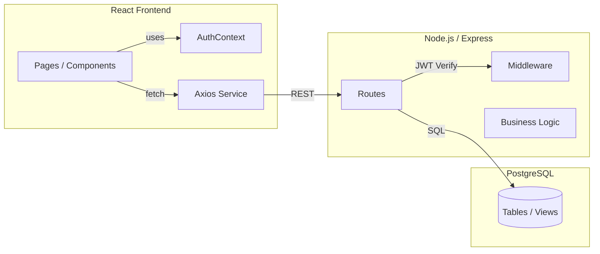

# GearGuard — Modern CMMS (Computerized Maintenance Management System)

> A production-ready maintenance management system with a unified, polished UI. Built with React, Tailwind CSS, Node.js/Express, and PostgreSQL.

## Highlights

- **Equipment Management**: Categories, departments, work centers, warranty, lifecycle
- **Maintenance Requests**: Corrective and Preventive with stages and KPI tracking
- **Kanban + Calendar**: Drag-and-drop pipeline and scheduled views
- **Teams and Technicians**: Assign technicians by maintenance team
- **Dashboard & Reports**: Overdue/upcoming/completed stats, grouped reports (Team/Category)
- **Polished UI**: Glassy, consistent theme across the app

## System Architecture



- Auth: JWT via Authorization header
- UI: Tailwind utilities with custom `.card`, `.glass`, `.btn`
- Reports: SQL aggregations exposed via `/api/dashboard/reports`

## Tech Stack

- Frontend: React 18, Tailwind CSS 3, React Router 6, react-beautiful-dnd, FullCalendar
- Backend: Node.js, Express, JWT
- Database: PostgreSQL

## Repository Structure

```
├── client/                      # React app
│   └── src/
│       ├── components/          # UI components (Layout, TaskModal, CalendarView)
│       ├── pages/               # Pages (Dashboard, Maintenance, Equipment, Reports)
│       ├── context/             # AuthContext
│       └── index.css            # Tailwind + custom utilities
├── server/                      # API server
│   ├── routes/                  # Express routes (auth, equipment, maintenance, dashboard)
│   ├── middleware/              # auth middleware
│   └── config/                  # db pool
├── database/                    # schema.sql
└── README.md
```

## Setup Instructions

### Prerequisites

- Node.js (v14 or higher)
- PostgreSQL (v12 or higher)
- npm or yarn

### Installation

1. **Clone the repository**
   ```bash
   cd odoo-gear-guard-maintenance
   ```

2. **Install dependencies**
   ```bash
   npm run install-all
   ```

3. **Database Setup**
   - Create a PostgreSQL database
   - Run the schema file:
     ```bash
     psql -U postgres -d gear_guard_db -f database/schema.sql
     node server/scripts/migrate.js   # optional helper (applies schema)
     node server/scripts/seed.js      # seed minimal data
     ```

4. **Environment Variables**
   - Copy `.env.example` to `.env`
   - Update the following variables:
     ```
     PORT=5000
     DB_HOST=localhost
     DB_PORT=5432
     DB_NAME=gear_guard_db
     DB_USER=postgres
     DB_PASSWORD=your_password
     JWT_SECRET=your_secret_key
     CLIENT_URL=http://localhost:3000
     ```

5. **Run the application**
   ```bash
   npm run dev
   ```

   This will start both the backend (port 5000) and frontend (port 3000) concurrently.

### Access the Application

- Frontend: http://localhost:3000
- Backend API: http://localhost:5000

## Core Use-Cases

### Corrective Maintenance
1. Create request for broken equipment
2. Auto-fills team/category from equipment
3. Move through stages New → In Progress → Repaired
4. Record hours spent

### Preventive Maintenance
1. Create request with `scheduled_date`
2. Appears in Calendar view
3. Technician executes and marks done

## Data Model (simplified)

- `users(id, name, email, password_hash, ...)`
- `maintenance_teams(id, name, company_id, ...)`
- `maintenance_team_members(team_id, user_id)`
- `equipment_categories(id, name, responsible_id, company_id, ...)`
- `equipment(id, name, category_id, department_id, employee_id, maintenance_team_id, ...)`
- `maintenance_requests(id, task_name, type, subject, equipment_id, assigned_by, assigned_to, team_id, stage, due_date, scheduled_date, priority, maintenance_type, duration, frequency, hours_spent, ...)`
- `work_centers(id, name, code, ...)`

## API Overview

- Auth: `POST /api/auth/register`, `POST /api/auth/login`
- Equipment: `GET/POST/PUT/DELETE /api/equipment`
- Maintenance Requests: `GET/POST/PUT /api/maintenance-requests`
- Teams: `GET/POST/PUT /api/maintenance-teams` (includes team `members`)
- Dashboard: `GET /api/dashboard/stats`, `GET /api/dashboard/tasks`, `GET /api/dashboard/reports?group_by=team|category`

All protected endpoints require `Authorization: Bearer <token>`.

## UI/UX Guidelines

- Use `.card` for primary sections/panels
- Use `.btn` / `.btn-primary` for actions; standard inputs
- Tables: soft dividers and rounded containers
- Toggles: prefer pill toggles for grouping filters (e.g., Reports)
- Modals: glass + rounded, consistent spacing

## Quality & Security

- Input normalization across routes: empty string → null for integer/date fields
- JWT auth via Express middleware
- ESLint via CRA; Tailwind for consistent design

## Scripts

- `npm run dev` — Start backend and frontend concurrently
- `npm run install-all` — Install root + client + server
- `node server/scripts/migrate.js` — Apply `database/schema.sql`
- `node server/scripts/seed.js` — Seed minimal data

## License

MIT
